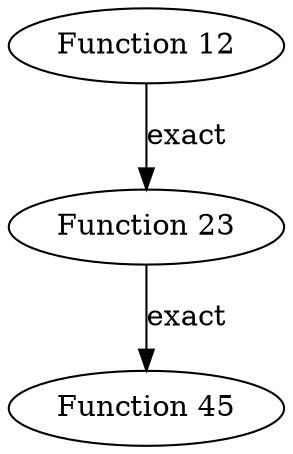

# WASM Duplicate Function Detection

A CLI tool to analyze Soroban contract WASM files for duplicate function bodies.

## Usage

```bash
node examples/wasm-duplicates <wasmFile> [options]
```

### Options
- `--output <format>`: Output format (json, csv, dot). Default: json
- `--compare <file>`: Compare with another WASM file
- `--min-size <n>`: Minimum function size in bytes
- `--exact-only`: Only report exact duplicates
- `--normalized`: Include normalized instruction matches
- `--threshold <n>`: Similarity threshold (0-100). Default: 95
- `--no-metadata`: Skip non-semantic metadata normalization

### Examples

```bash
# Basic analysis
node examples/wasm-duplicates contract.wasm

# Compare two versions
node examples/wasm-duplicates old.wasm --compare new.wasm

# CSV output with similarity threshold
node examples/wasm-duplicates contract.wasm --output csv --threshold 90

# DOT graph output
node examples/wasm-duplicates contract.wasm --output dot
```

## Output

### JSON
```json
{
  "totalFunctions": 42,
  "uniqueFunctions": 35,
  "duplicateGroups": 3,
  "duplicatedFunctions": 7,
  "largestGroupSize": 3,
  "duplicateCodePercentage": 16.7,
  "duplicatedInstructionCount": 1245,
  "groups": [
    {
      "functions": [12, 23, 45],
      "bodySize": 420,
      "fingerprint": "a1b2c3...",
      "instructionCount": 120,
      "similarity": "exact",
      "instructions": ["local.get", "i32.add", ...]
    }
  ]
}
```

### CSV
```csv
Group,Functions,Size,Instructions,Similarity,Fingerprint
1,"12,23,45",420,120,exact,a1b2c3...
2,"7,19",280,85,normalized,b4d5e6...
```

### DOT

